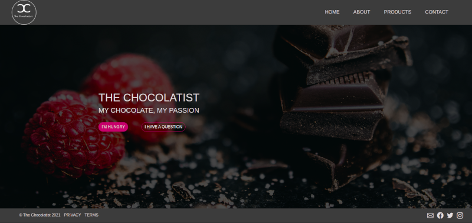
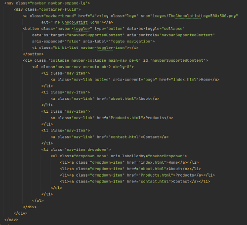
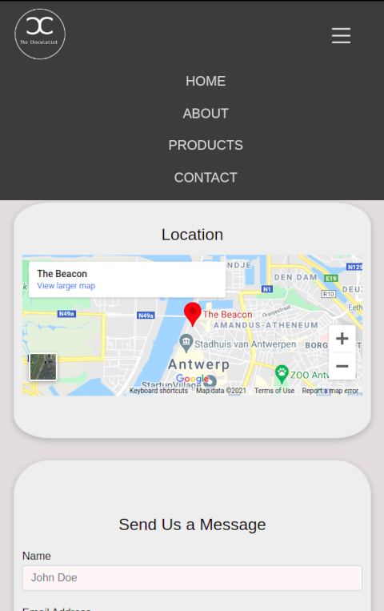
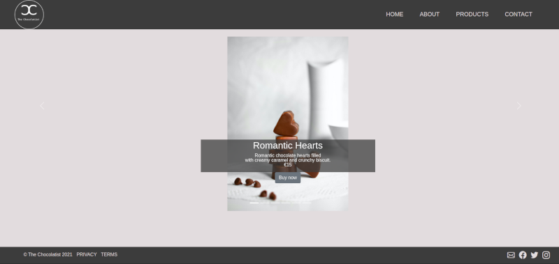
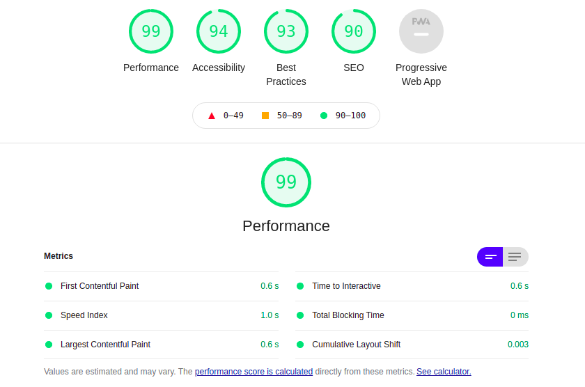
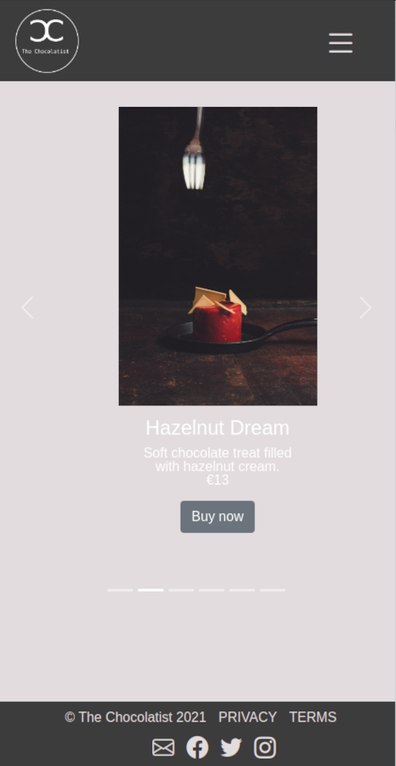
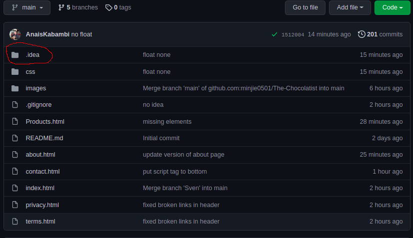

# The Chocolatist

***

This is a simple multi-page website for a fictional chocolate retail store that aims to produce hand-crafted chocolates and chocolate based confection.

## Team
***

**The Chocolatist** is the brainchild of **four** dedicated BeCoders:  
**- Sven**  
**- Shreejan** 
**- Anais**  
**- Minjie**

## Goal
***

The goal of this project was to create a fictional company and its associated website.  
As a team, we chose to create The Chocolatist, a chocolatier specialised in hand-crafted chocolates and confection. 

## The creation process and deployment
***

This exercise was our first real group project and thus our first time truly collaborating on GitHub.  
Check out [our website](https://minjie0501.github.io/The-Chocolatist/index.html) and this repository to see the result of our 3-day group effort!.

###The Folder structure

* The Chocolatist
  * all.html files go here
  * [folder] css
    * all .css files go here
  * [folder] images
    * all image files go here
  

### Technologies used
* **HTML5**
* **CSS3**
* **Bootstrap 5**
* **JavaScript**

1. The navbar using bootstrap 5 
   
2. Contact page on mobile screens 
   
3. Carousel
   
4. The lighthouse test results
   

***

## Issues we encountered along the way

* Working with bootstrap 5 to create a custom carousel was it's own challenge for Anais, she tackled it with grace. 
  
* The ever present .idea folder is like a boomerang, it keeps coming back! 
  

